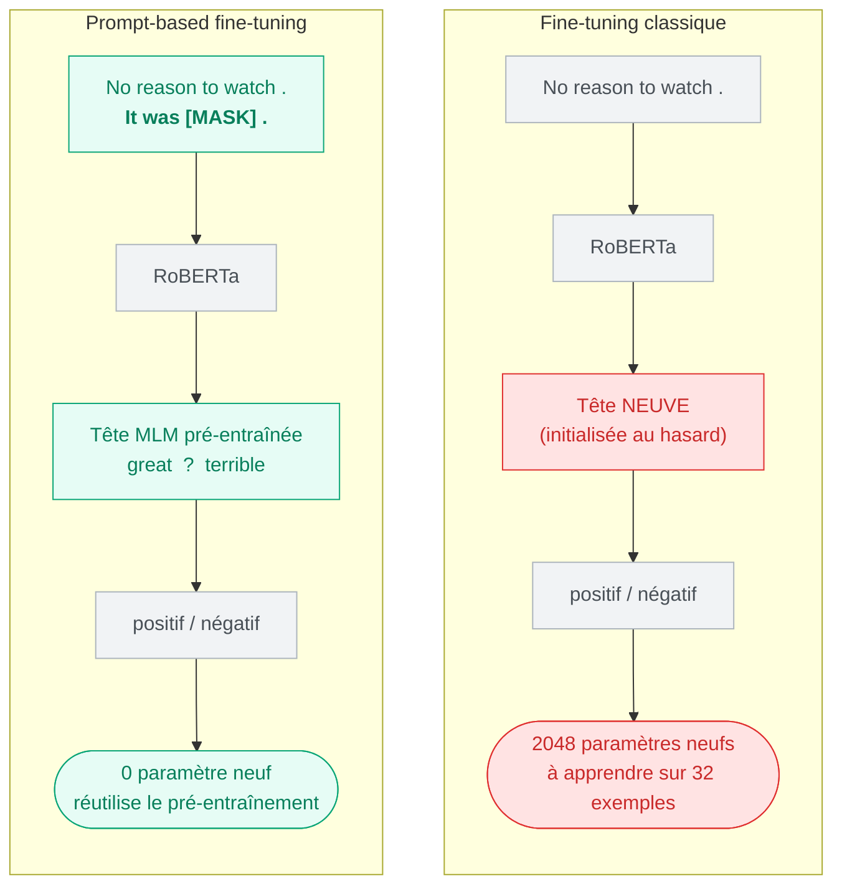

<div align="center">

# LM-BFF · Making Pre-trained Language Models Better Few-shot Learners

**Reproduction du papier [Gao et al., ACL 2021](https://aclanthology.org/2021.acl-long.295.pdf)**
*Comment rendre un petit modèle aussi bon que GPT-3 en few-shot — avec seulement 16 exemples par classe.*


</div>

---

## La problématique

> **GPT-3** réussit le *few-shot learning* (apprendre une tâche avec une poignée d'exemples)…
> mais ses **175 milliards de paramètres** le rendent inutilisable en pratique.

Deux contraintes nous bloquent quand on veut faire pareil avec un petit modèle :

| Contrainte | Pourquoi ça coince |
|---|---|
| **GPT-3 est trop lourd** | Impossible à faire tourner sur du matériel normal |
| **Le fine-tuning classique échoue** | Avec 16 exemples, une tête de classification neuve apprend… du bruit |

<div align="center">

### Peut-on rendre un petit modèle (RoBERTa) aussi performant en few-shot, sans expertise humaine pour concevoir les prompts ?

</div>

---

## L'idée : le *prompt-based fine-tuning*

Au lieu d'ajouter une tête de classification (2048 paramètres aléatoires à apprendre à partir de rien),
on **reformule la tâche en problème de « remplir le blanc »** — exactement ce que le modèle sait déjà faire.



<div align="center">
<sub><i>Le modèle a déjà vu des milliards de « … It was great / terrible » pendant son pré-entraînement.
On lui repose sa question native au lieu de lui en inventer une nouvelle.</i></sub>
</div>

**Template** : `{phrase} It was [MASK] .`  ·  **Mots-labels** : positif → `great`, négatif → `terrible`

---

## Résultats (reproduction · SST-2)

RoBERTa-large · K=16 · 5 graines · moyenne ± écart-type · test = 872 phrases

| Méthode | **Nous** | Papier |
|---|:---:|:---:|
| Prompt-based zero-shot | **81.7** | 83.6 |
| Fine-tuning classique | **75.5 ± 6.3** | 81.4 ± 3.8 |
| **Prompt-based FT (manuel)** | **89.2 ± 1.0** | 92.7 ± 0.9 |
| Prompt-based FT (auto T5) | *à venir* | 92.3 |

<div align="center">

### La thèse du papier, reproduite

**+13.7 points** (89.2 vs 75.5) · **6× plus stable** (±1.0 vs ±6.3)
*Avec les mêmes 32 exemples, le prompt-based écrase le fine-tuning classique — en précision **et** en robustesse.*

</div>

---

## Reproduire

```bash
# Dépendances
pip install torch transformers datasets scikit-learn

# 1 · Voir le mécanisme sans entraînement (zero-shot)
python src/zero_shot_eval.py        #  ~81.7 %

# 2 · Le cœur : prompt-based fine-tuning (5 graines)
python src/train.py                 #  89.2 ± 1.0

# 3 · Le baseline classique, pour la comparaison
python src/baseline.py              #  75.5 ± 6.3
```

---

## Structure

```text
src/
 ├── sanity_check.py     # démo : RoBERTa prédit great/terrible (zero-shot)
 ├── data.py             # SST-2, échantillonnage K=16 + val + test
 ├── zero_shot_eval.py   # prompt-based zero-shot sur tout le test
 ├── train.py            # prompt-based fine-tuning (manuel)  ← le coeur
 └── baseline.py         # fine-tuning classique (comparaison)
RESULTS.md               # tableau détaillé + conclusions
```

---

## Feuille de route

- [x] **Prompt-based fine-tuning** — zero-shot, manuel, baseline
- [ ] **Pipeline d'auto-génération des templates** (§5.2, via **T5**) — *le cœur restant*
- [ ] *(option)* Auto-sélection des mots-labels (§5.1)
- [ ] *(option)* Élargir à d'autres tâches (SST-5, TREC, SNLI)

---

<div align="center">
<sub>Reproduction pédagogique · <a href="https://aclanthology.org/2021.acl-long.295.pdf">Gao, Fisch & Chen — ACL 2021</a></sub>
</div>
